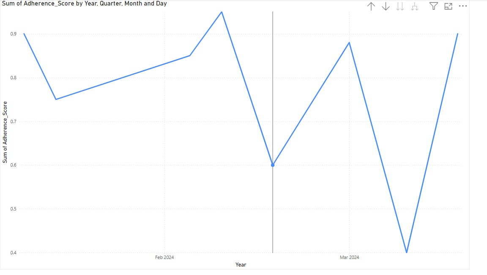
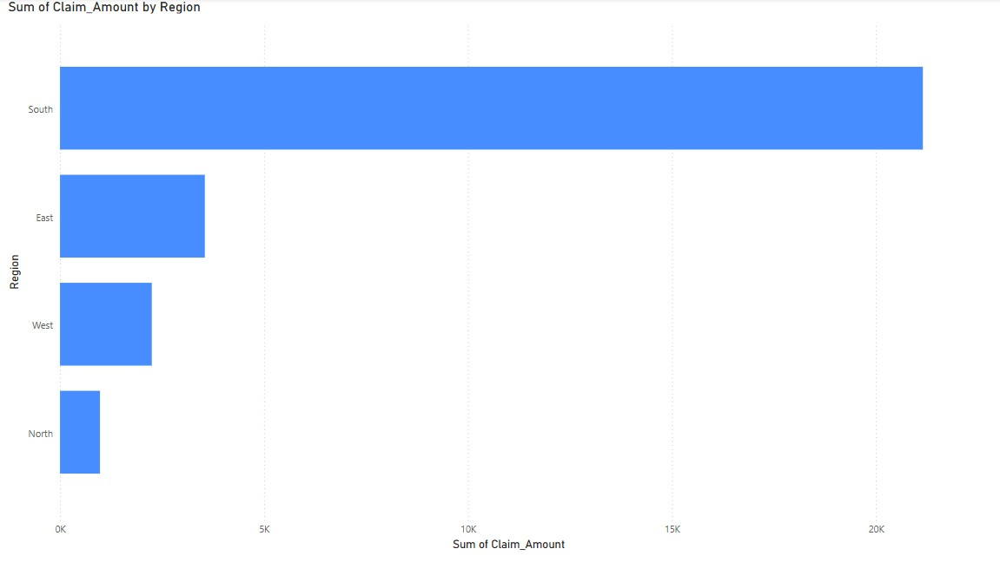
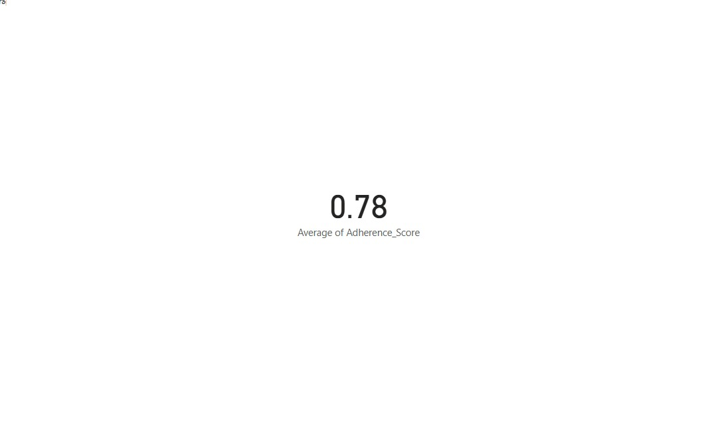
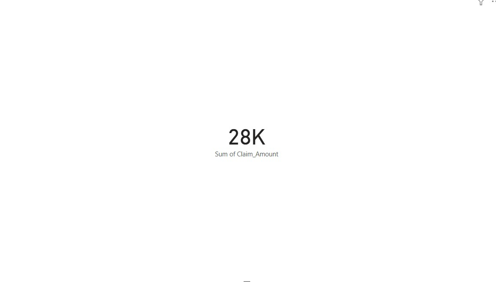
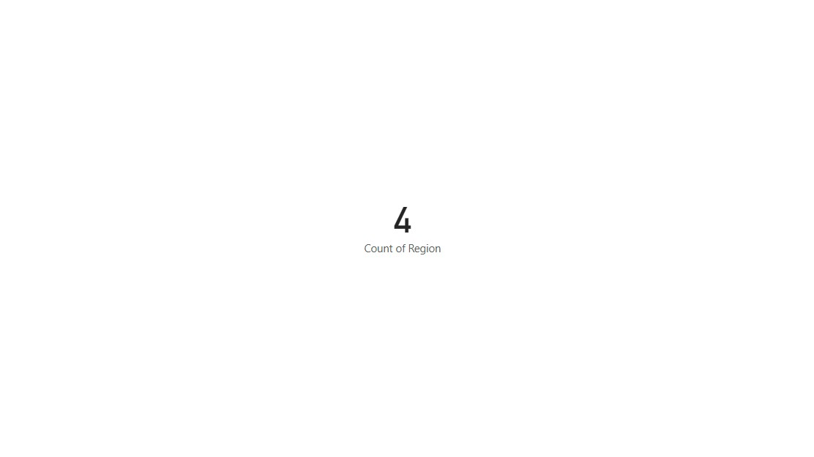

# 🩺 Real-Time Compliance Monitoring Dashboard

This project uses **Python**, **SQL**, and **Power BI** to monitor compliance metrics in a healthcare dataset, detect anomalies, and generate business insights via dashboards.

---

## 🔍 Project Highlights

- Cleaned and transformed patient claim data using **Python (Pandas)**.
- Detected adherence anomalies and compliance patterns.
- Visualized insights using **Power BI dashboards**.
- Deployed KPIs like:
  - 📊 Avg Adherence Score
  - 💰 Total Claim Amount
  - 🌍 Region Count

---

## 📊 Sample Visualizations

### 1. Line Chart: Adherence Score Over Time

### 2. Bar Chart: Claim Amount by Region

### 3. KPI Cards
- 
- 
- 

---

## 📁 Folder Structure
_______________________________________

---

## 🚀 Tools Used
- Python (Pandas, Matplotlib)
- Power BI (KPIs, line charts, bar charts)
- Git & GitHub

---

## 🔗 Connect
Feel free to connect with me on [LinkedIn](https://www.linkedin.com/in/niharikagarikaparthi/) or explore my other projects!

